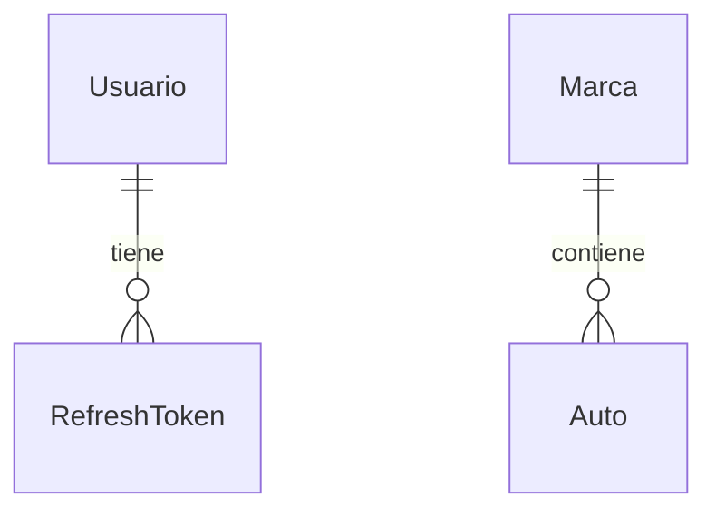

# ORM con Sequelize — Guía didáctica

Este proyecto usa **Sequelize** como ORM (Object-Relational Mapping) para hablar con SQLite sin escribir SQL a mano en cada operación.

## ¿Qué es un ORM?

Un ORM traduce entre **objetos JavaScript** y **tablas relacionales**:

- Clase/modelo `Marca` ↔ tabla `marcas`
- Instancia `marca.save()` ↔ `INSERT` o `UPDATE`
- `Marca.findAll({ include: Auto })` ↔ `SELECT` con `JOIN`

Ventajas: menos SQL repetitivo, validaciones centralizadas, migraciones versionadas.  
Desventajas: curva de aprendizaje; consultas muy complejas a veces son más claras en SQL puro.

## Modelos en este proyecto

| Modelo         | Tabla             | Rol                                      |
|----------------|-------------------|------------------------------------------|
| `Usuario`      | `usuarios`        | Cuentas de acceso                        |
| `RefreshToken` | `refresh_tokens`  | Sesiones / refresh tokens hasheados      |
| `Marca`        | `marcas`          | Entidad **aislada** (ejemplo CRUD)       |
| `Auto`         | `autos`           | Entidad **relacionada** (`marcaId` FK)   |

Los archivos viven en `src/models/`. El archivo `src/models/index.js` carga todos los modelos y ejecuta `associate()` para definir relaciones.

## Asociaciones

```javascript
// Marca hasMany Auto
Marca.hasMany(models.Auto, { foreignKey: 'marcaId', as: 'autos' });

// Auto belongsTo Marca
Auto.belongsTo(models.Marca, { foreignKey: 'marcaId', as: 'marca' });
```

En consultas:

```javascript
Auto.findAll({
  include: [{ model: Marca, as: 'marca' }],
});
```

El alias `as: 'marca'` debe coincidir en modelo y `include`.

## Migraciones vs modelos

| Enfoque      | Archivo              | Propósito                          |
|--------------|----------------------|------------------------------------|
| **Migración**| `src/migrations/*.js`| Cambios versionados del esquema BD |
| **Modelo**   | `src/models/*.js`    | Comportamiento y validaciones en app |

Flujo recomendado:

```bash
npx sequelize-cli migration:generate --name descripcion-cambio
# editar migración
npm run db:migrate
```

**No uses** `sync({ force: true })` en producción: borra datos. En este curso usamos migraciones explícitas.

## Validaciones

Sequelize valida en el modelo, por ejemplo en `Auto`:

```javascript
anio: {
  type: DataTypes.INTEGER,
  validate: { min: 1900, max: new Date().getFullYear() + 1 },
}
```

Además, **express-validator** valida el body HTTP antes del controlador (`src/validators/`).

## Restricciones de integridad

En la migración de `autos`:

```javascript
references: { model: 'marcas', key: 'id' },
onDelete: 'RESTRICT',
```

No puedes borrar una marca que aún tiene autos; la API también devuelve **409** si intentas eliminarla con autos asociados.

## Paginación

Los listados usan `findAndCountAll` con `limit` y `offset` (ver `src/utils/pagination.js`):

```javascript
const { page, limit, offset } = parsePagination(req.query);
const { rows, count } = await Marca.findAndCountAll({ limit, offset });
```

Respuesta:

```json
{
  "success": true,
  "data": [ ... ],
  "pagination": { "page": 1, "limit": 10, "total": 3, "totalPages": 1 }
}
```

## Seeders

Datos de demostración en `src/seeders/`:

```bash
npm run db:seed
```

Útil para que todos los estudiantes tengan las mismas marcas y autos de prueba.

## Transacciones (concepto)

Si una operación requiere varios pasos atómicos (p. ej. crear arriendo y marcar auto no disponible), Sequelize ofrece:

```javascript
await sequelize.transaction(async (t) => {
  await Arriendo.create({ ... }, { transaction: t });
  await Auto.update({ ... }, { where: { id }, transaction: t });
});
```

La actividad final de **Cliente/Arriendo** es buen lugar para practicar esto.

## Diagrama entidad-relación



## Archivos clave para estudiar

1. `src/models/marca.js` y `src/models/auto.js` — asociación N:1
2. `src/controllers/marcaController.js` — CRUD simple
3. `src/controllers/autoController.js` — `include` de Marca
4. `src/migrations/` — esquema real de la BD

## Próximo paso

Lee la [actividad final](../actividades/actividad-final-cliente-arriendo.md) y replica el patrón Marca/Auto con **Cliente** y **Arriendo**.
